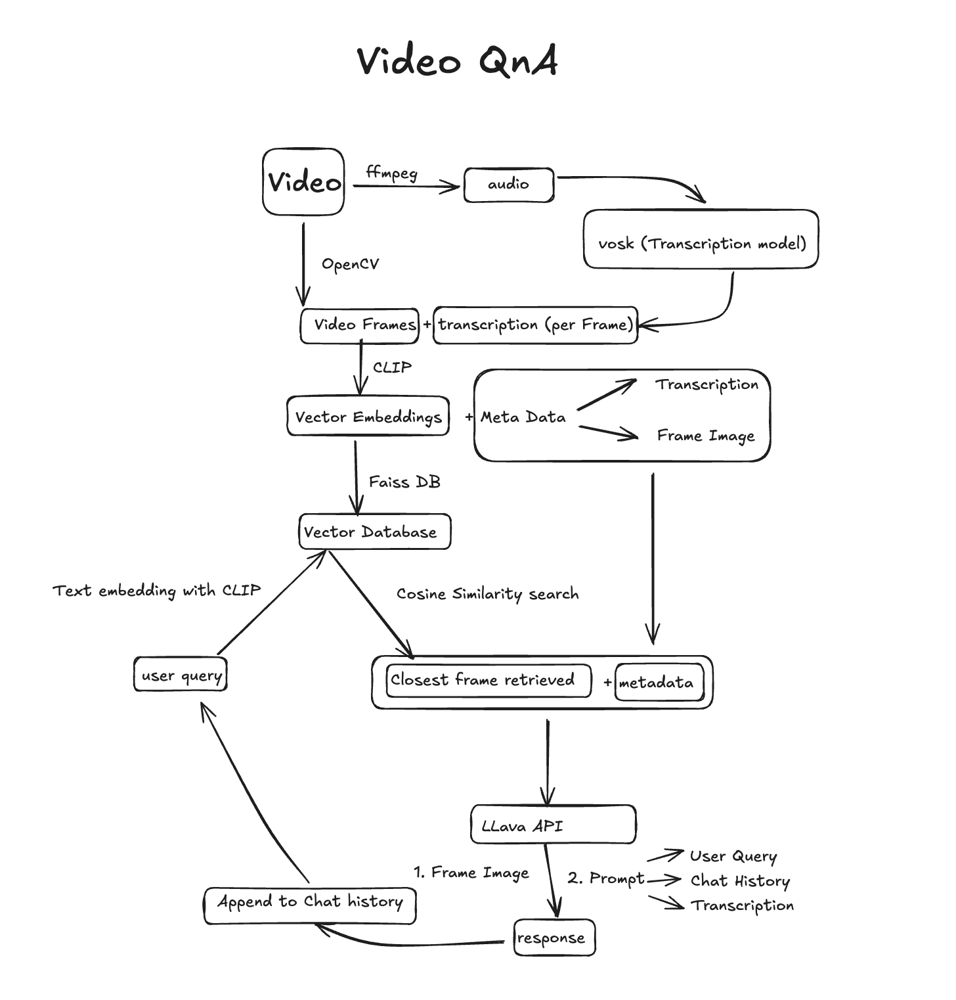

# VideoQA – Ask Questions About Any Video!

> A full-stack AI-powered application that allows users to upload a video and ask context-aware questions about it using CLIP, FAISS, and LLaVA via Segmind API.

---

## How It Works

1. **Upload a Video** via a React + Tailwind frontend.
2. **Frame Extraction**: Key frames are extracted using OpenCV.
3. **Embedding**: Frames are embedded using Hugging Face’s CLIP model.
4. **Indexing**: Embeddings are stored and queried with FAISS.
5. **Questioning**: User questions are semantically matched to the most relevant frames.
6. **Answering**: Segmind's LLaVA API generates answers using the retrieved context.

---



## Tech Stack

### Backend (FastAPI)
- CLIP (Hugging Face `openai/clip-vit-large-patch14`)
- FAISS (vector similarity search)
- Segmind LLaVA API
- OpenCV (frame extraction)
- Python, PIL, Torch

### 💻 Frontend (Vite + React)
- Tailwind CSS
- Fetch API (HTTP-based interaction)

---

## Getting Started

### 🔧 Prerequisites

- Python ≥ 3.9
- Node.js ≥ 18
- [Segmind LLaVA API Key](https://segmind.com/)

---

## Backend Setup (FastAPI)

```bash
# Clone the repo
git clone https://github.com/coderuhaan2004/VideoQA.git
cd VideoQA/backend

# Create a virtual env
python -m venv venv
source venv/bin/activate  # or venv\Scripts\activate on Windows

# Install dependencies
pip install -r requirements.txt

# Run the server
python app.py
```

## Frontend Setup (Vite-React)
```bash
# Clone the repo
cd VideoQA/chatbot

# Install Libraries
npm install

# Run
npm run dev
```
